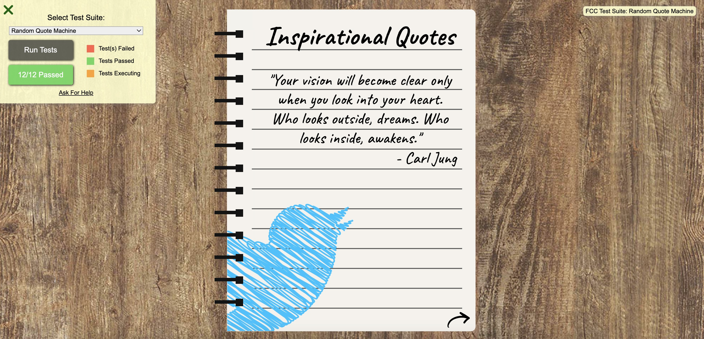
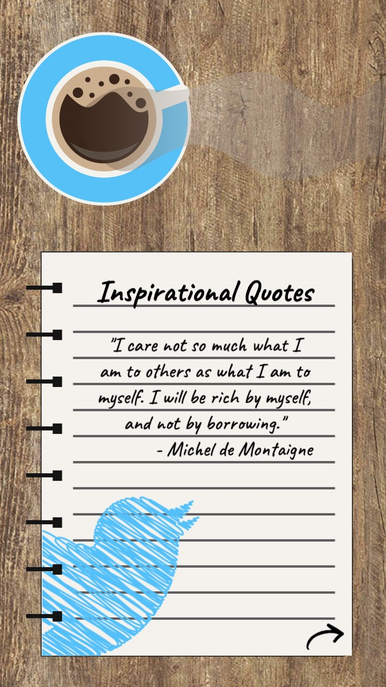
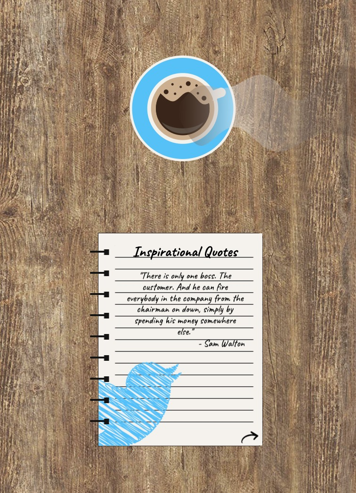
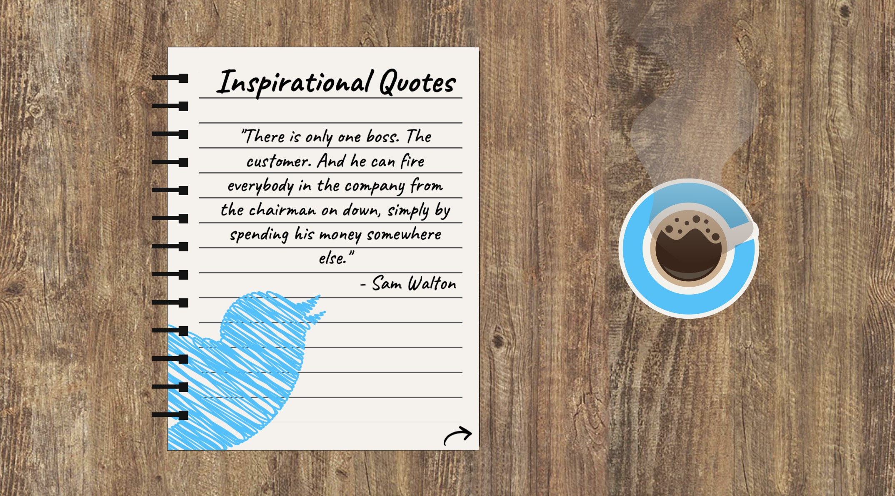

# Front End Development Libraries Project 1 - FreeCodeCamp

This is a responsive random quote machine. It’s part of the required projects to complete FreeCodeCamp’s Front End Development Libraries certification.

There are two branches in this project: 
- main: the project passes the 12 FreeCodeCamp tests. It means that the requirements have been respected. 
- desktop-with-coffee: in that second version, with a desktop viewport, the coffee is still visible, positioned beside the notebook (passes only 11 out of the 12 tests, that's why it's not the main).

## Table of contents

- [Overview](#overview)
  - [The challenge](#the-challenge)
  - [Screenshot](#screenshot)
  - [Links](#links)
- [My process](#my-process)
  - [Built with](#built-with)
  - [What I learned](#what-i-learned)
  - [Continued development](#continued-development)
  - [Useful resources](#useful-resources)
- [Author](#author)

## Overview

### The challenge

The goal is to build an app that is functionally similar to the [random quote machine](https://random-quote-machine.freecodecamp.rocks/) given as example.

The exact requirements:

1. A wrapper element with a corresponding id="quote-box".
2. Within #quote-box, an element with a corresponding id="text".
3. Within #quote-box, an element with a corresponding id="author".
4. Within #quote-box, a clickable element with a corresponding id="new-quote".
5. Within #quote-box, a clickable a element with a corresponding id="tweet-quote".
6. On first load, the quote machine displays a random quote in the element with id="text".
7. On first load, the quote machine displays the random quote's author in the element with id="author".
8. When the #new-quote button is clicked, the quote machine should fetch a new quote and display it in the #text element.
9. The quote machine should fetch the new quote's author when the #new-quote button is clicked and display it in the #author element.
10. The user can tweet the current quote by clicking on the #tweet-quote a element. This a element should include the "twitter.com/intent/tweet" path in its href attribute to tweet the current quote.
11. The #quote-box wrapper element should be horizontally centered (run tests with browser's zoom level at 100% and page maximized).

### Screenshot

    
    
    
    

### Links

- Challenge URL: [Challenge URL](https://www.freecodecamp.org/learn/front-end-development-libraries/front-end-development-libraries-projects/build-a-random-quote-machine)
- Live Site URL: [Live site URL](https://leo-code-ca.github.io/random-quote-machine/)

## My process

### Built with

- Sass
- jQuery (+ plugin)
- BEM methodology

### What I learned

It has been an insane project for me! In order to obtain my third FreeCodeCamp certification (Front End Libraries), I have to build five projects. This is the first one. Before starting, I quickly looked at each of them and this one seemed to be the easiest one. I decided to use jQuery for the JavaScript part as I used React for my previous project. I also prefer to use React for more “complex” apps. 

Actually, the project itself wasn't particularly hard but the way I decided to do it was definitely not the simplest one! I'd say I definitely complicated the challenge when I chose to build a virtual notebook with a flipping page effect and a coffee with its steam! I don't regret it, I'm satisfied of the result but it really gave me a hard time!

I struggled learning more about SVGs, mostly about how to animate them. I spend so much time finding how to create this flipping page animation. First, I tried with a plugin. I read all the documentation but it wasn't working as expected at all. After a few days, I decided to try something else and I actually achieved what I wanted with "pure" jQuery! Finally, making all this app responsive was a real challenge and took me quite a while. 

The good point is that I've learned so much while building only one project! I'm really happy and grateful of that!

Let's summarize what I've learned:

- Sass without Bootstrap (my first time)
- Sass functions and mixins accepting arguments
- SVG linear gradients
- SVG animations 
- Fetch API with jQuery 
- jQuery page flip animation
- Responsive image map with jQuery plugin (for the twitter logo)

### Continued development

I definitely need to learn more in-depth jQuery. I understood that my knowledge is way too basic for now, even after the FreeCodeCamp and W3Schools lessons. I probably need to have a better look at the official documentation and build more project with it. It was also my first time using a plugin. I'd like to learn more about those. 

I feel a little more comfortable working with SVGs after this project but they are still new to me. I'd like to be able to use them without struggling that much!

I also discovered that responsiveness can be way harder than what I thought, especially when you have a lot of different elements to manage. Making responsive all the pieces of the coffee cup, the steam, the notebook spirals and holes gave me a lot of troubles. I definitely didn't think about that before starting and, I should have! I'll be more cautious in the future! 

### Useful resources

- [Flip page effect with jQuery](https://lenadesign.org/2021/12/09/book-page-flip-css-jquery/) - this is a great article that inspired me to build my notebook flip page effect!
- [Responsive image map](https://www.youtube.com/watch?v=8wM5nBLy8c8) - thank you SO MUCH to this person without who I'd probably still be struggling trying to understand how to make my image map responsive!
- [Draw your image map](https://imagemap.org/) - amazing website where you upload your picture and draw your map on it while the website is converting it into HTML!

## Author

- GitHub - [@Leo-Code-CA](https://github.com/Leo-Code-CA)
- FreeCodeCamp - [@Leo-code](https://www.freecodecamp.org/Leo-code)

